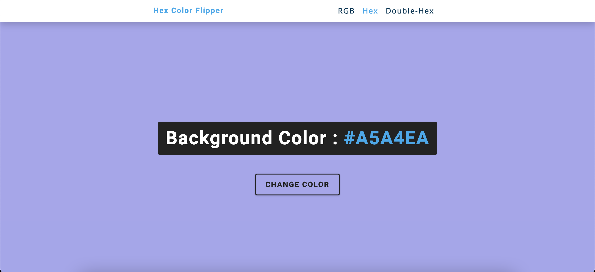
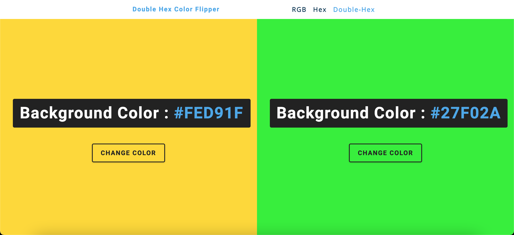

# Color Pickers

        

A color flipper that changes the background color when the user clicks the button. There are three different types of color flips in this project: rgb, hex, side by side hex (double hex). The double hex color flippers allow the user to compare two colors side by side.

## Technologies used
- HTML
- CSS
- Vanilla Javascript

*Change the colors by clicking on the **change color** button*

> Rgb Color Flipper

> Hex Color Flipper

> Side by side Hex color flipper

